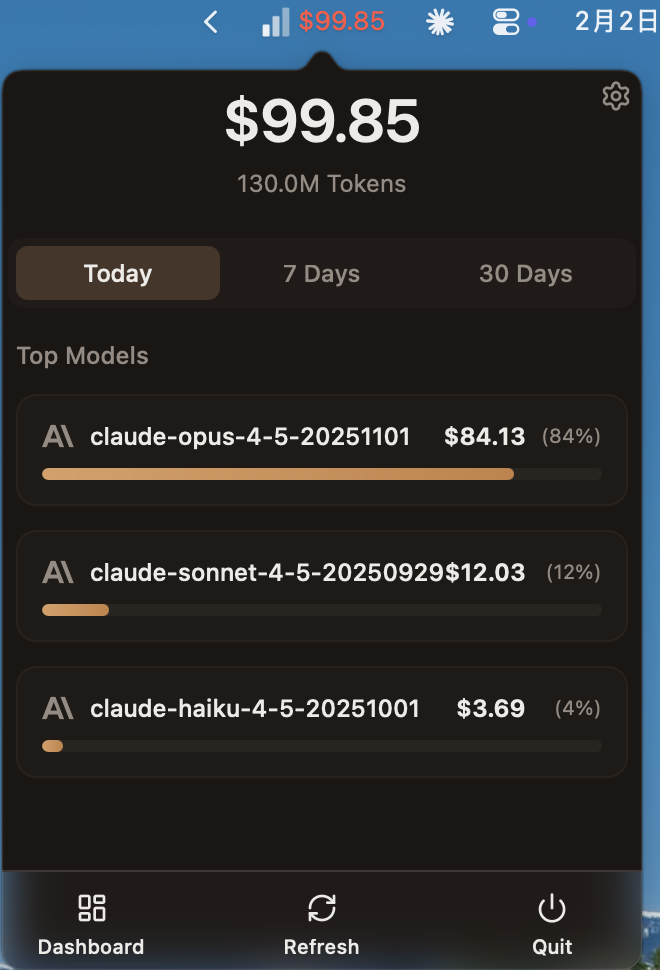

# TokenMeter

English | [中文](README.zh.md)

[](LICENSE)
[]()
[]()
[]()

> A macOS menu bar app for real-time API usage tracking and cost monitoring.
>
> Inspired by the xbar plugin `claude_tokens.15m.py`, rebuilt as a standalone native app with Tauri 2 + React.



## Features

- Real-time API usage display in menu bar
- Dashboard with detailed charts and statistics
- Support for ccusage and custom API providers
- Configurable refresh interval, display format, and budget alerts
- Launch at login
- Multi-language support (English / Chinese)

## Quick Start

### Prerequisites

- Node.js 18+
- Rust 1.75+
- macOS 10.15+
- [ccusage](https://github.com/ryoppippi/ccusage) (optional, for Claude API usage tracking)

### Installation

```bash
npm install
```

### Development

```bash
npm run tauri dev
```

### Build

```bash
npm run tauri build
```

Build artifacts are located in `src-tauri/target/release/bundle/`.

## Configuration

Config files are stored in `~/.tokenmeter/`:

| Path | Description |
|------|-------------|
| `config.json` | App settings (refresh interval, menu bar format, budget, language) |
| `providers/*.json` | Custom API provider configurations |

## Tech Stack

- **Backend**: Tauri 2 + Rust
- **Frontend**: React 19 + TypeScript + Vite
- **UI**: TailwindCSS v4 + shadcn/ui
- **Data**: Recharts + TanStack Query
- **i18n**: i18next + react-i18next

## Architecture

For detailed architecture diagrams and data flow documentation, see [docs/ARCHITECTURE.md](docs/ARCHITECTURE.md).

## Development

See [AGENTS.md](AGENTS.md) for detailed development commands and code conventions.

### Quality Checks

```bash
# Frontend lint
npm run lint

# Rust checks (run in src-tauri/)
cargo fmt --check && cargo clippy && cargo test
```

## Contributing

Contributions are welcome! Please read [AGENTS.md](AGENTS.md) for development guidelines and quality gates before submitting PRs.

## License

[MIT](LICENSE)
