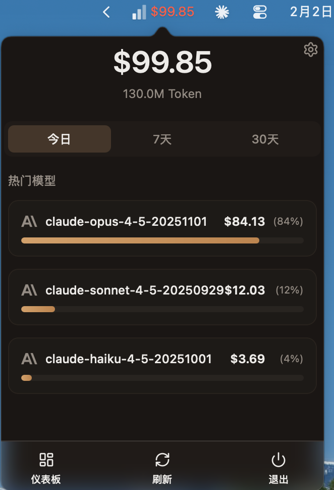

# TokenMeter

[English](README.md) | 中文

[](LICENSE)
[]()
[]()
[]()

> 一款 macOS 菜单栏应用，用于实时追踪 API 用量和费用监控。
>
> 灵感来自 xbar 插件 `claude_tokens.15m.py`，使用 Tauri 2 + React 重构为独立原生应用。



## 功能特性

- 菜单栏实时显示 API 用量
- Dashboard 窗口查看详细图表和统计
- 支持 ccusage 和自定义 API Provider
- 可配置刷新间隔、显示格式、预算告警
- 开机自启动
- 多语言支持（中文 / 英文）

## 快速开始

### 环境要求

- Node.js 18+
- Rust 1.75+
- macOS 10.15+
- [ccusage](https://github.com/ryoppippi/ccusage)（可选，用于 Claude API 用量追踪）

### 安装依赖

```bash
npm install
```

### 开发模式

```bash
npm run tauri dev
```

### 生产构建

```bash
npm run tauri build
```

构建产物位于 `src-tauri/target/release/bundle/`。

## 配置

配置文件存储在 `~/.tokenmeter/`：

| 路径 | 说明 |
|------|------|
| `config.json` | 应用设置（刷新间隔、菜单栏格式、预算、语言） |
| `providers/*.json` | 自定义 API Provider 配置 |

## 技术栈

- **后端**: Tauri 2 + Rust
- **前端**: React 19 + TypeScript + Vite
- **UI**: TailwindCSS v4 + shadcn/ui
- **数据**: Recharts + TanStack Query
- **国际化**: i18next + react-i18next

## 架构

详细的架构图和数据流说明请参阅 [docs/zh/ARCHITECTURE.md](docs/zh/ARCHITECTURE.md)。

## 开发指南

详细的开发命令和代码规范请参阅 [AGENTS.md](AGENTS.md)。

### 质量检查

```bash
# 前端 lint
npm run lint

# Rust 检查（在 src-tauri/ 目录运行）
cargo fmt --check && cargo clippy && cargo test
```

## 参与贡献

欢迎贡献代码！提交 PR 前请阅读 [AGENTS.md](AGENTS.md) 了解开发规范和质量门槛。

## 许可证

[MIT](LICENSE)
